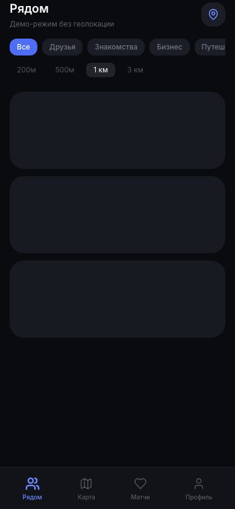

# Radius — люди рядом

> Локационная социальная сеть в формате Telegram Mini App. Находи людей рядом, отправляй сигналы, заводи знакомства.



## 🏗 Архитектура

```
┌─────────────┐     ┌─────────────┐     ┌─────────────┐
│   Telegram  │────▶│    Nginx    │────▶│  Next.js    │
│  Mini App   │     │   (reverse)  │     │  (frontend)  │
└─────────────┘     └──────┬──────┘     └─────────────┘
                           │
                           ▼
                    ┌─────────────┐
                    │   FastAPI   │
                    │  (backend)  │
                    └──────┬──────┘
                           │
              ┌────────────┼────────────┐
              ▼            ▼            ▼
        ┌─────────┐ ┌──────────┐ ┌──────────┐
        │PostgreSQL│ │  Redis   │ │ Yandex   │
        │+PostGIS │ │ (pub/sub)│ │  Maps    │
        └─────────┘ └──────────┘ └──────────┘
```

| Сервис | Технология | Роль |
|--------|-----------|------|
| Backend | FastAPI + SQLAlchemy (async) | REST API, WebSocket, JWT |
| Frontend | Next.js 14 + Tailwind CSS | Telegram Mini App, PWA |
| Database | PostgreSQL 15 + PostGIS | Гео-данные, профили, матчи |
| Cache | Redis 7 | Pub/sub, presence, сессии |
| Proxy | Nginx | TLS, WebSocket, статика |

## ⚡ Быстрый старт

```bash
# 1. Клонируйте репозиторий
git clone https://github.com/YOUR_USERNAME/radius.git
cd radius

# 2. Создайте .env файл из примера
cp .env.example .env
# Отредактируйте .env — добавьте TELEGRAM_BOT_TOKEN и NEXT_PUBLIC_YANDEX_MAPS_KEY

# 3. Запустите
make up        # или: docker compose up --build -d
```

Откройте http://localhost:8080

## 📋 Переменные окружения

```env
# === Backend ===
DATABASE_URL=postgresql+asyncpg://radius:radius_secret@db:5432/radius_db
REDIS_URL=redis://redis:6379
SECRET_KEY=change-this-in-production-min-32-characters-long
TELEGRAM_BOT_TOKEN=your_telegram_bot_token_from_botfather
CORS_ORIGINS=http://localhost:3000,https://your-domain.com

# === Frontend (build-time) ===
NEXT_PUBLIC_API_URL=https://your-domain.com/api/v1
NEXT_PUBLIC_WS_URL=wss://your-domain.com/api/v1
NEXT_PUBLIC_YANDEX_MAPS_KEY=your_yandex_maps_api_key_here
```

## 🤖 Telegram Mini App

### 1. Создайте бота через @BotFather

```
/newbot → @Radius_my_bot
/mybots → @Radius_my_bot → Bot Settings → Menu Button → Configure menu button
                        → Configure Web App → URL: https://your-domain.com
```

### 2. Настройте Web App

- **URL**: `https://your-domain.com` (должен быть HTTPS)
- **Short name**: `Radius`
- **Mode**: `Expand` (fullscreen)

### 3. Проверка initData

Backend валидирует `initData` из Telegram Web App через `HMAC-SHA256` с токеном бота. Никогда не отключайте проверку в production.

## 🚀 Деплой

### Вариант A: VPS + Docker (рекомендуется)

```bash
# На сервере (Ubuntu 22.04)
git clone https://github.com/YOUR_USERNAME/radius.git
cd radius
cp .env.example .env
# Редактируем .env
sudo docker compose up --build -d
```

Не забудьте:
- **HTTPS** — Let's Encrypt + Nginx (или Cloudflare)
- **Домен** — привязать A-запись к серверу
- **Firewall** — открыть 80, 443, закрыть 8000, 3000, 5432, 6379

### Вариант B: Railway / Render (PaaS)

| Сервис | Backend | DB | Frontend |
|--------|---------|----|----------|
| **Railway** | Deploy Dockerfile + `DATABASE_URL` из Railway Postgres | Автоматически | Отдельный сервис или static |
| **Render** | Web Service из Dockerfile | PostgreSQL | Static Site |

> ⚠️ Для Railway/Render нужно разделить `docker-compose.yml` на отдельные сервисы.

### Вариант C: Kubernetes (для production)

```bash
kubectl apply -f k8s/
# namespace + deployment + service + ingress + secrets
```

## 🔐 Безопасность

- `.env` **никогда** не попадает в git (уже в `.gitignore`)
- `SECRET_KEY` — минимум 32 символа, генерируйте через `openssl rand -hex 32`
- `TELEGRAM_BOT_TOKEN` — храните в Docker Secrets или Vault
- PostgreSQL — закрыт внутри Docker network, не exposed наружу
- Nginx — единственная точка входа (80/443)

## 📁 Структура проекта

```
radius/
├── app/                  # FastAPI backend
│   ├── api/routes/       # REST endpoints (auth, geo, chat, profile, interactions)
│   ├── core/             # Config, security, DB session
│   ├── db/               # Redis connection
│   ├── models/           # SQLAlchemy + Pydantic schemas
│   ├── services/         # Business logic (auth, geo, chat, match)
│   └── websocket/        # Real-time: presence, matches, chat
├── frontend/             # Next.js 14 + Tailwind
│   ├── app/              # App Router pages
│   ├── components/       # AppLayout, FilterBar, EmptyState
│   ├── hooks/            # useGeolocation, useWebSocket
│   ├── store/            # Zustand auth store
│   └── styles/           # Tailwind + globals
├── nginx/                # Reverse proxy + SSL
├── docker-compose.yml    # Локальная разработка
├── Dockerfile            # Backend image
├── requirements.txt
├── init_db.sql           # Схема БД + PostGIS
└── .env.example          # Шаблон переменных
```

## 🛠 Команды Make

```bash
make up          # docker compose up --build -d
make down        # docker compose down
make logs        # docker compose logs -f
make db          # подключиться к PostgreSQL
make ps          # статус контейнеров
```

## 📱 PWA / Mini App фичи

- Тёмная тема, glass morphism, анимации
- Safe-area для iPhone (notch, home indicator)
- Нижняя навигация (как в нативном приложении)
- WebSocket для real-time матчей и уведомлений
- Геолокация + фильтры по радиусу (50м–3км)

## 📄 Лицензия

MIT

## 🙏 Credits

Built with FastAPI, Next.js, PostgreSQL/PostGIS, Redis, Tailwind CSS, Framer Motion.
